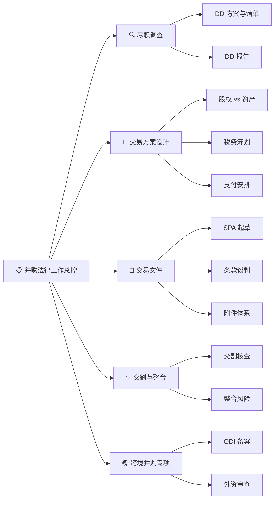

# 🏛️ China M&A Legal Skills

<p align="center">
  
  
  
  
</p>

<p align="center"><strong>面向中国并购法律实务的 AI Agent Skills 集合</strong></p>
<p align="center">股权并购 · 资产并购 · 跨境并购 — 全流程端到端</p>

---

## 🎯 覆盖范围



## 📦 Skill 一览

| # | Skill | 场景 | 核心能力 |
|:--:|:---|:---|:---|
| 🧠 | **并购法律工作总控** | 总路由 | 语义路由、事项隔离、质量门、法规校验 |
| 🔍 | **并购尽职调查** | DD | 尽调清单生成、发现问题分析、DD 报告撰写 |
| 📐 | **并购交易方案设计** | 方案 | 结构设计、税务框架、支付安排、交割条件 |
| 📝 | **并购交易文件** | 文件 | SPA/SHA/APA 起草、条款库（买卖双方视角） |
| ✅ | **并购交割与整合** | 交割 | 交割核查表、流程管理、整合风险评估 |
| 🌏 | **跨境并购专项** | 跨境 | ODI 备案、外资审查、法律冲突分析 |

## 🚀 安装

```bash
# 1. 克隆仓库
git clone https://github.com/12754271-maker/merger-acquisition-skill.git

# 2. 复制到 QClaw skills 目录
cp -r skills/ma ~/.qclaw/skills/ma/

# 3. 编辑身份信息
# 编辑 skills/ma/并购法律工作总控/references/practice-profile.md
```

## 💬 使用示例

对 QClaw 直接说：

| 你说 | QClaw 调用的 Skill |
|------|-------------------|
| 「帮我写一份制造业并购尽调清单」 | 并购尽职调查 |
| 「我是买方，起草 SPA 核心条款」 | 并购交易文件 |
| 「收购一家新加坡公司要什么流程」 | 跨境并购专项 |
| 「股权收购和资产收购怎么选」 | 并购交易方案设计 |
| 「帮我准备交割条件核查表」 | 并购交割与整合 |
| 「做个XX公司的并购尽调方案」 | 总控自动路由 → 尽职调查 |

## 🏗️ 架构

```
skills/ma/
├── SKILL.md                         ← QClaw 自动发现入口
├── README.md                        ← 模块说明
│
├── 并购法律工作总控/
│   ├── SKILL.md                     ← 总路由 + 质量门调度
│   └── references/                  ← 7 个共享协议
│       ├── practice-profile.md         身份配置
│       ├── routing-map.md              语义路由映射
│       ├── matter-workspace-protocol    事项隔离
│       ├── document-reading-protocol    完整读取
│       ├── legal-verification-protocol  法规校验
│       ├── source-boundary-protocol     来源边界
│       ├── delivery-quality-gate        交付质量门
│       └── output-header-template       输出模板
│
├── 并购尽职调查/
│   ├── SKILL.md
│   └── templates/dd-report-template.md
│
├── 并购交易方案设计/
│   └── SKILL.md
│
├── 并购交易文件/
│   ├── SKILL.md
│   └── references/spa-clause-library.md
│
├── 并购交割与整合/
│   └── SKILL.md
│
└── 跨境并购专项/
    └── SKILL.md
```

## ⚠️ 免责声明

本项目为 AI 辅助工具，不构成法律意见。所有输出须经执业律师审查，不替代律师判断。

## 📄 License

[MIT](LICENSE)

---

<p align="center">
  Made with ❤️ for Chinese M&A lawyers
</p>
